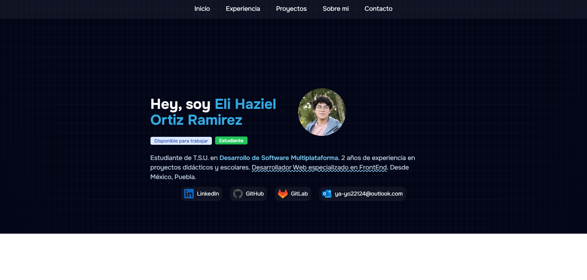

# Portafolio Web

>[!NOTE]
>Proyecto en fase de desarrollo

Este es mi proyecto de Portafolio Web para presentarme como desarollador y principalmente hablar sobre mi experiencia demostrando los proyectos que he realizado y mantenido en plataformas como GitHub o GitLab.

El desarrollo de este proyecto personal fue realizado en el framework web de **Astro 4.0**, elegido por su gran flexibiliad y eficiencia para sitios estáticos no tan complejos como para necesitar de un framework/librería más avanzado como Angular o React. Gracias a esto y su fácil uso, es que permite dar una gran experiencia de desarollo y al usuario.


## Capturas




## Tech Stack

**Client:** Astro, TailwindCSS, TailwindCSS Animated

**Server:** Node

## Estructura del Proyecto

📦Portfolio

 ┣━ 📂public
 
 ┃ ┣━ 📜favicon.svg
 
 ┃ ┗━ 📜portfolio_view.png
 
 ┣━ 📂src
 
 ┃ ┣━ 📂components
 
 ┃ ┃ ┣━ 📂icons
 
 ┃ ┃ ┃ ┣━ 📜BriefCaseIcon.astro
 
 ┃ ┃ ┃ ┣━ 📜GitHub.astro
 
 ┃ ┃ ┃ ┣━ 📜GitLab.astro

 ┃ ┃ ┃ ┣━ 📜LinkedIn.astro
 
 ┃ ┃ ┃ ┗━ 📜Outlook.astro
 
 ┃ ┃ ┣━ 📜Badge.astro
 
 ┃ ┃ ┣━ 📜Header.astro
 
 ┃ ┃ ┣━ 📜TimeLine.astro
 
 ┃ ┃ ┗━ 📜TimeLineItem.astro
 
 ┃ ┣━ 📂core
 
 ┃ ┃ ┗━ 📂interfaces
 
 ┃ ┃ ┃ ┗━ 📜TimeLineItem.interface.ts
 
 ┃ ┣━ 📂layouts
 
 ┃ ┃ ┗━ 📜Layout.astro
 
 ┃ ┣━ 📂pages
 
 ┃ ┃ ┗━ 📜index.astro
 
 ┃ ┗━ 📜env.d.ts
 
 ┣━ 📜.gitignore
 
 ┣━ 📜astro.config.mjs
 
 ┣━ 📜package.json
 
 ┣━ 📜README.md
 
 ┣━ 📜tailwind.config.mjs
 
 ┗━ 📜tsconfig.json
 


## Ejecutar Localmente

Clonar proyecto

```bash
  git clone https://github.com/Yayo22124/Portfolio.git
```

Moverse al proyecto

```bash
  cd Portfolio
```

Instalar dependencias

```bash
  npm install
```

Ejecutar modo desarrollo

```bash
  npm run dev
```

## Autores

<div style="width: 80px; display: flex;">
  
  
  
  [@Yayo22124](https://www.github.com/Yayo22124)

</div> 
